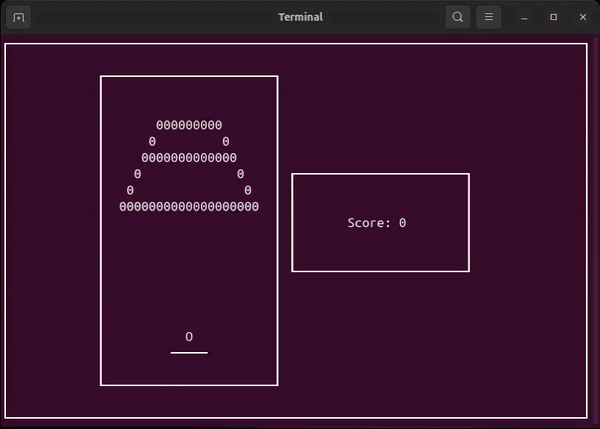

# Arkanoid

Консольная версия игры «Арканоид» на C++ с использованием библиотеки ncurses.

## Описание

Arkanoid — это простая консольная аркада, в которой:  
- Есть шар, отражающийся от платформы.  
- Игрок управляет платформой с клавиатуры.
- Есть блоки, которые нужно разбить шаром.
- Реализована логика столкновений, отражения, победы/поражения.

## Управление

- **← / →** или **A / D** — движение платформы
- **Пробел** — ускорение шара

## Demo



## Требования

- GCC/Clang с поддержкой C++17
- CMake 3.10 или выше
- Библиотека ncurses (libncurses-dev)
- ОС: Linux

## Установка зависимостей

**Ubuntu/Debian:**
```bash
sudo apt-get install libncurses-dev cmake g++
```

## Как собрать и запустить

```bash
git clone https://github.com/AgapeColor/Arkanoid.git
cd Arkanoid
mkdir build && cd build
cmake ..
make
./arkanoid
```

## Лицензия

MIT License